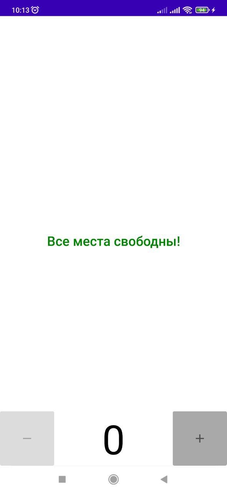
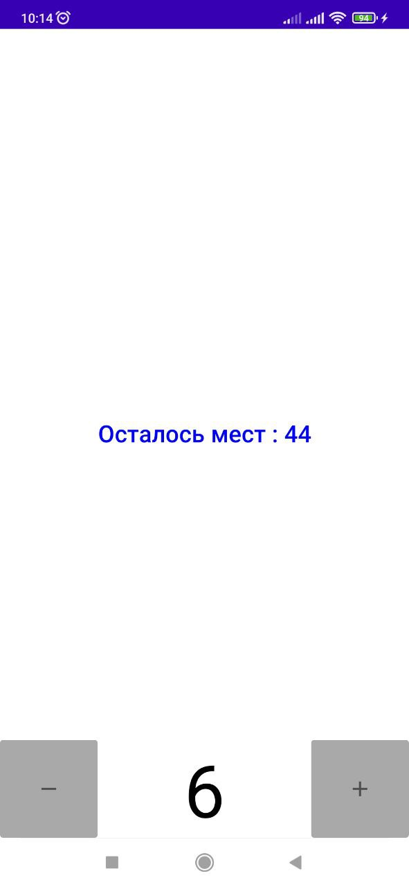
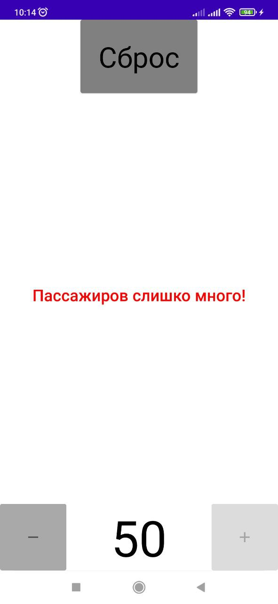

# Задание 1

## Необходимо разработать небольшое приложение-счётчик для подсчёта пассажиров, входящих в автобус. Приложение должно иметь примерно следующий вид:
• Нажатие кнопок «+» и «-» изменяет значение счётчика и тестовых полей на «+1» и «-1» соответственно. Задавать значение меньше 0 нельзя.  
• Кнопка «Сброс» не только сбрасывает счётчик, но и возвращает приложение в первоначальное состояние (скриншот 1).  
• В автобусе 49 сидячих мест. Мы хотим отправлять автобусы максимально наполненными, но допускать превышения нельзя. Слишком большое количество пассажиров — это повод для немедленного отправления.  
• Если все места свободны, текст по середине — зелёный, кнопка «-» — недоступна.  
• При количестве пассажиров от 1 до 49 текст синий, кнопки доступны. Кнопка «Сброс» невидимая.  
• При количестве пассажиров 50 и выше текст красный, появляется кнопка «Сброс».

1.2.3.

## Советы и рекомендации:
О формате цвета RGB:  
• статья в Википедии;  
• онлайн-конвертер.  
Остальные материалы приложены к урокам.

### Что оценивается:
• Работа приложения соответствует описанию.  
• Обработка текущего значения и изменение состояния программы описано в одном методе (не допускайте дублирования кода).  
• Приложение корректно отрабатывает сброс счётчика.  
• Нет критичных багов и вылетов.  
• Код чистый, у переменных и компонентов понятные названия, соблюдаются принципы ООП

### Как отправить работу на проверку
• Используйте репозиторий android_dev_1_2022.  
• Скачайте изменения в репозитории на ваш компьютер.  
• Выполните домашнее задание в папке m1_hello_world. Создайте проект внутри папки, сделайте коммит или несколько коммитов. Отправьте коммиты в удалённый репозиторий.

Ссылка на репозиторий.